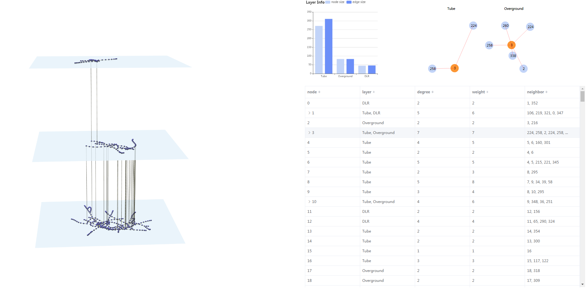

# Multilayer-network-2.5D-visualization
> explore Multilayer network via 2.5D visualization based on threejs &amp; vuejs &amp; echartjs &amp; d3js

#### Run step

+ First  preprocess the source data by run the `Preprocess_Data.py`, which was collected in 2013 from the official website of Transport for London (<https://www.tfl.gov.uk/>) and manually cross-checked. see more complex multilayer networks dataset in this website(https://comunelab.fbk.eu/) .
+ Then your PC need to install a web server, like Apache (recommended)、Tomcat、IIS.

+ If you have installed the Apache HTTP Server, you can put this poject in the `htdocs`  file directory， then you can run the `Multilayer_network.html`

#### Multilayer-network-2.5D view

Multilayer-network-2.5D view can effectively present the topology of the data. we aggregate data from different layers, and then use Fruchterman-Reingold algorithm to layout, this way can ensure consistency between the layers. we also provide rich interaction ways like rotation、emphasization to observe the data better.

#### bar chart

bar chart present multilayer-network's layer information, included node numbers and edges numbers.

#### Ego network view 

when click the row in the Table view , Ego network view will show the chosen node's ego network. 

#### Table view 

Table view present detailed multilayer-network information, it's column attributes has node ID 、layer 、degree（degree sum if node has children node）、weight (weight sum)、neighbor node . And you can sort the table according to those column attributes.